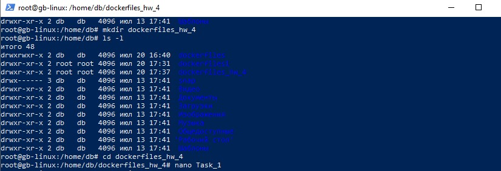
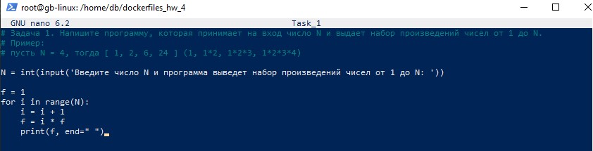
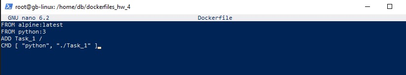
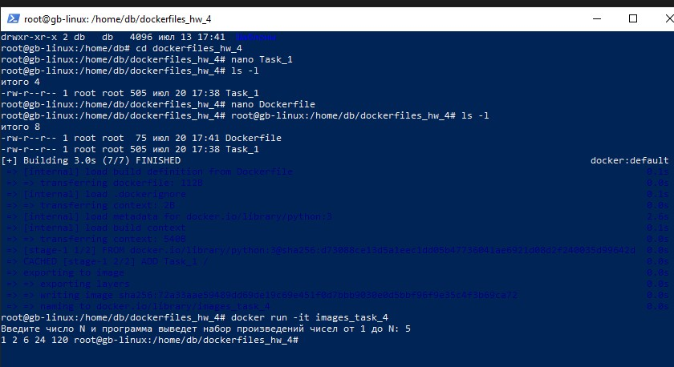

Задание: необходимо создать Dockerfile, основанный на любом образе (вы в праве выбрать самостоятельно). В него необходимо поместить приложение, написанное на любом известном вам языке программирования (Python, Java, C, С#, C++). При запуске контейнера должно запускаться самостоятельно написанное приложение.

Решение :

Создаем директорию "dockerfiles_hw_4"
mkdir dockerfiles_hw_4

В данной директории создаем файл "Task_1" и меняем его содержимое (в данном случае написана программа на языке Python)
nano Task_1

В данной директории создаем файл "Dockerfile" на основе образа alpine:latest и меняем его содержимое
nano Dockerfile

Собираем наш образ под названием "images_task_4" и запускаем контейнер
docker build -t images_task_4 .

docker run -it images_task_4

Программа запускается, запрашивает число и выдает результат.